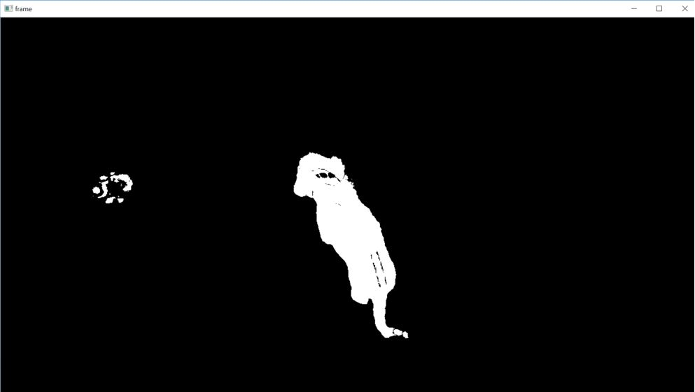
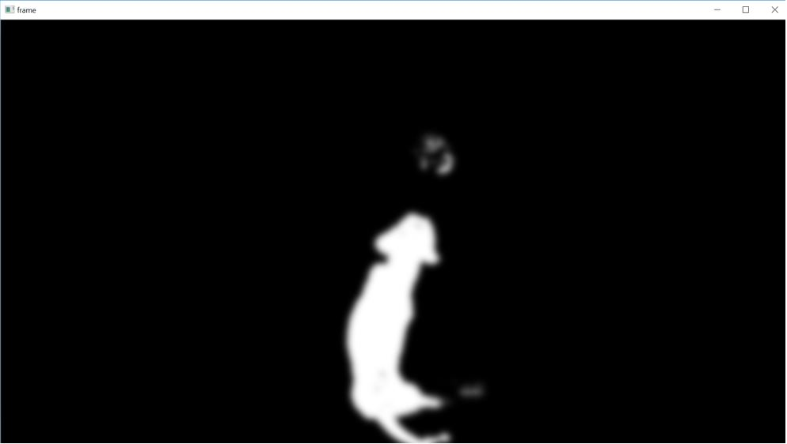
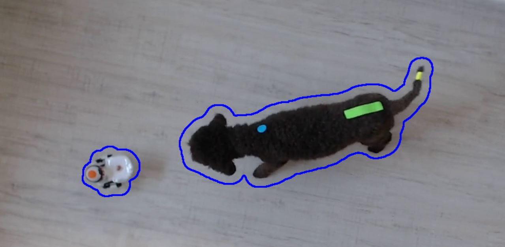
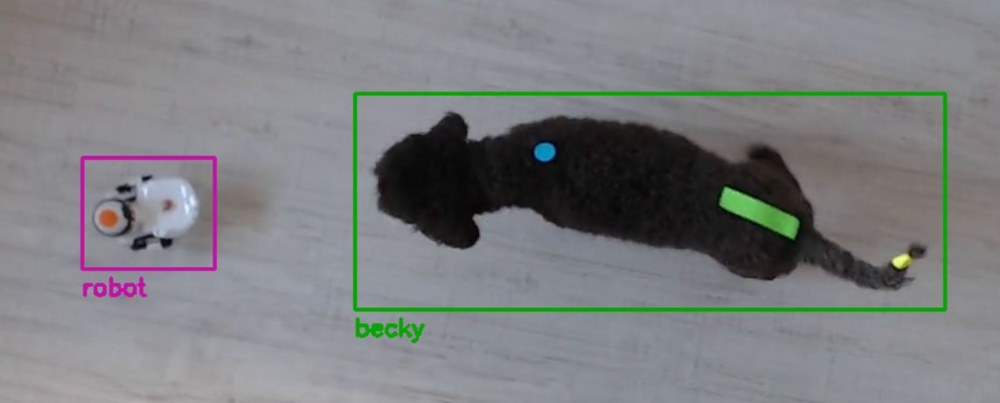
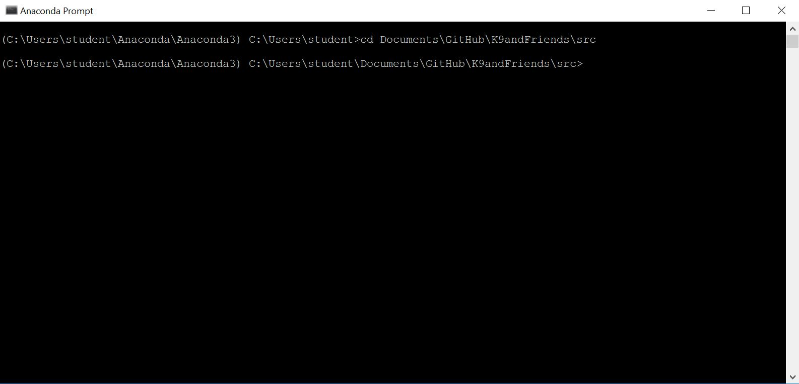
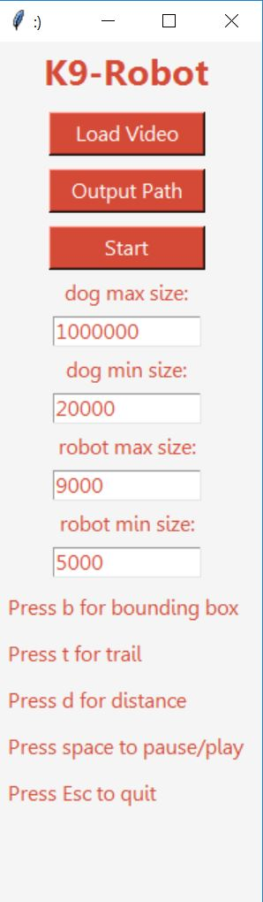
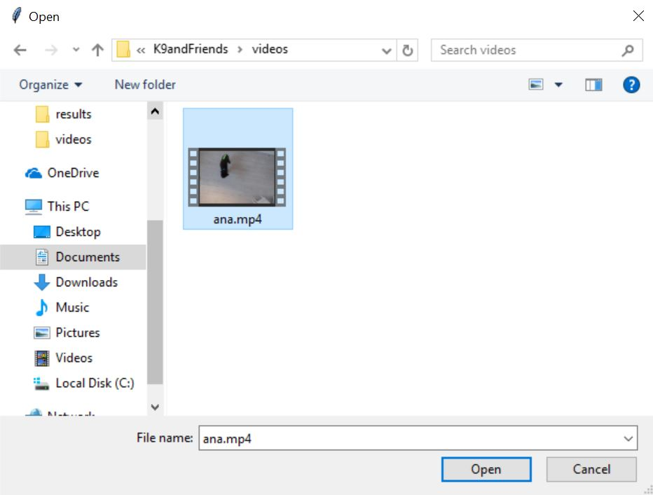
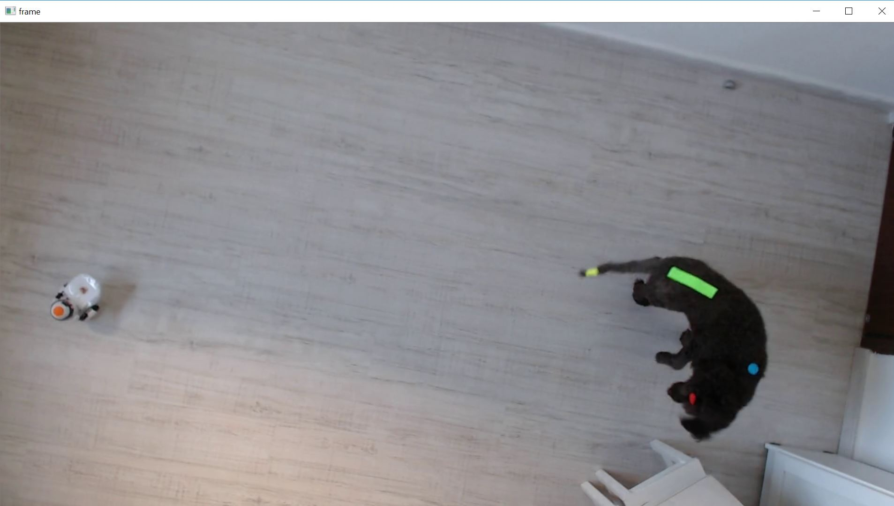
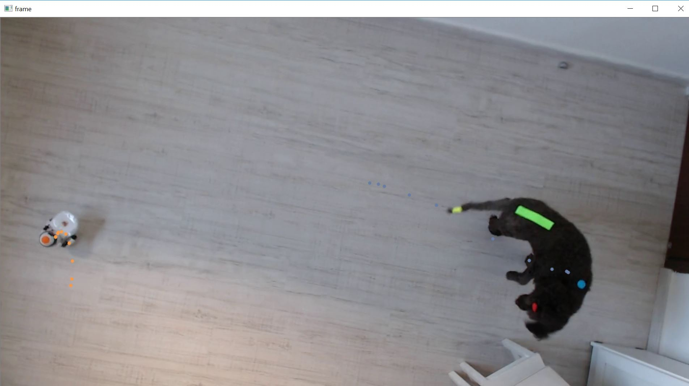
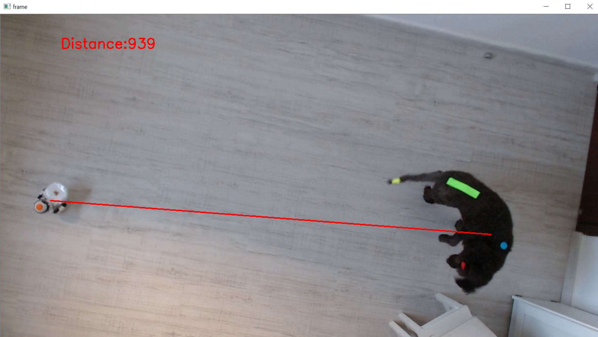

# Canine - Robot Interaction 

The program attempts to assist ACI researchers to investigate Canine-Robotic interaction. 
This prototype currently tracks a canine and a robot, then calculates the distance between them at any given time.

## Algorithm & Technique
In order to track both the canine and the robot, we needed to deploy several computer vision techniques. 

### Background Subtraction
Background subtraction is a technique used to discover motion in a video.
This simply means to look at the difference between each pair of subsequent frames.
It is known that still areas in the image remian through the video while motioned areas differ from each other.
Thus, after background subtraction the zeroed (black areas) had no motion while the positive (white) areas did.
For example, a background subtraction between a pair of frames:  

    

It is very easy to notice the dog's and the robot's contours.
Now, we apply a *gussian blur* over the image, in order to "fill in" the little holes within each object's contours.  

  

Hence, detecting the objects' contours will be easier.

### Contour Detector
In order to find the location of each moving object in the image, we use an *Edge Decetdor*. OpenCV offers an edge detector based on border following, wich we chose to use. 

The results are very pleasing, for instance:  

  

Notice that the detected contours are somewhat far from the real contours of the objects. That is due to the former blurring.

### Kalman Filter
We used the *Kalman Filter* algorihtm in order to track each object through time. 
In general, Kalman filter expects the position of the object each interval of time and uses it to correct its predictions of the new position and velocity of the object. 
This way, we can track the object even if at times there are no contours to be found. It makes our tracking algorithm more robust.  

  

We attribute each object with its closest contour of a certain size which is to be calibrated when switching videos.
Now all that is left is to calculate the distance between the robot and the canine for each frame.

## Building & Using Instructions

1. We use **Anaconda 2.4.0** Python Distribution on **Windows 10**. Download `Anaconda3-2.4.0-Windows-x86_64.zip` from [this link](https://repo.continuum.io/archive/.winzip/ "zipped Windows installers"), unzip and install.

2. After setting up Anaconda (or an anaconda environment), make sure all the following modules are up-to-date:
  * Cython >= 0.23
  * Six >= 1.7.3
  * SciPy >= 0.17.0
  * Numpydoc >= 0.6
  * NetworkX >= 1.8
  * Pillow >= 2.1.0
  * PyWavelets >= 0.4.0
  * Scikit-image >= 0.12.3

This can be done by type `conda list` in the conda prompt and observe the different modules.  
In case one needs to be installed or updated, simply type `conda module_name install` in the conda prompt. 
OpenCV is installed by typing `conda install -c menpo opencv3=3.1.0` in the conda prompt.

3. Clone `K9andFriends` repo into your computer.

4. Open the conda prompt and enter `K9andFriends/src`:  

  

5. Type `python gui.py` into your conda prompt:  

  

6. Now the GUI will be opened:  

  

7. Load the video you wish to analyze by pressing *Load Video* button. Then, a file discussion will open:  

  

8. After chosing your video, chose an output folder similarily by pressing *Output Path* button.

9. Now, calibrate the programs' parameters. They state the maximal and minimal size of each object. It is recommended that the canine and the robot will have a significant difference of sizes.

10. Press the start button to begin analyzing the video:  

  

11. You may reveal / vanish special features:

* Bounding box - by pressing 'b'.  

  

* Location trail - by pressing 't'.  

  

* Distance measure - by pressing 'd'.  

  

12. You may pause and play by pressing the spacebar.

13. You may quit the video (or the whole program) by pressing Esc.

14. Once finished, you can find your analysed video in the output repository.  

